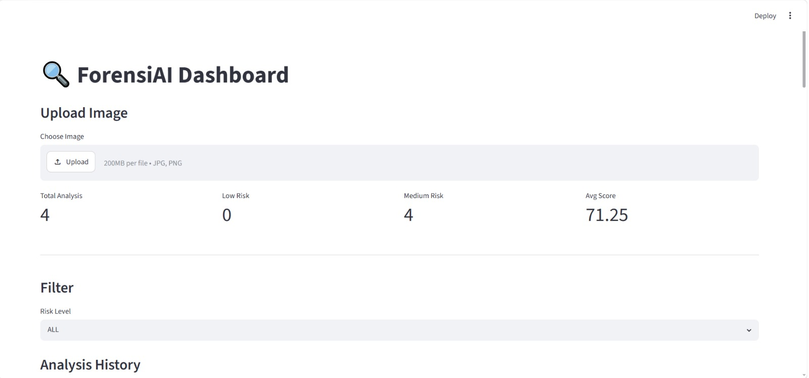

# ForensiAI

AI-powered digital image forensic analysis platform built with FastAPI, Streamlit, SQLite, and ReportLab.

## Features

- Image Upload
- EXIF Metadata Extraction
- Error Level Analysis (ELA)
- Risk Scoring
- Investigation Dashboard
- Analysis History
- Delete Analysis
- Statistics API
- CSV Export
- PDF Investigation Report

---

## Dashboard



---

## Investigation Report


---

## Tech Stack

- FastAPI
- Streamlit
- SQLite
- SQLAlchemy
- ReportLab
- Pandas
- Pillow

---

## Installation

```bash
pip install -r requirements.txt
```

Run Backend:

```bash
uvicorn backend.main:app --reload
```

Run Frontend:

```bash
streamlit run frontend/dashboard.py
```

---

## Project Structure

```text
forensiai/
│
├── backend/
├── frontend/
├── uploads/
├── reports/
├── docs/
├── tests/
├── requirements.txt
└── README.md
```

---

## Current Version

v0.9.0

## Author

Muhammad Yahya
